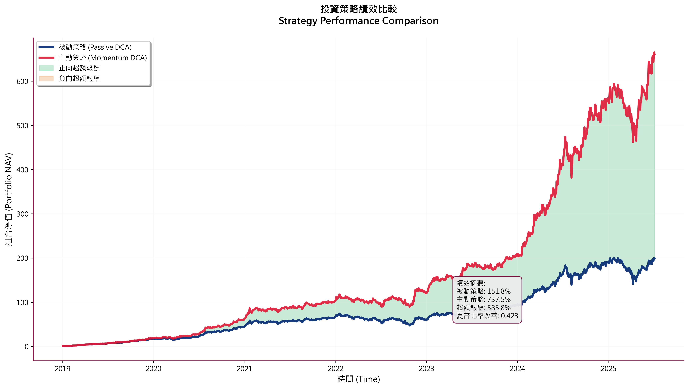
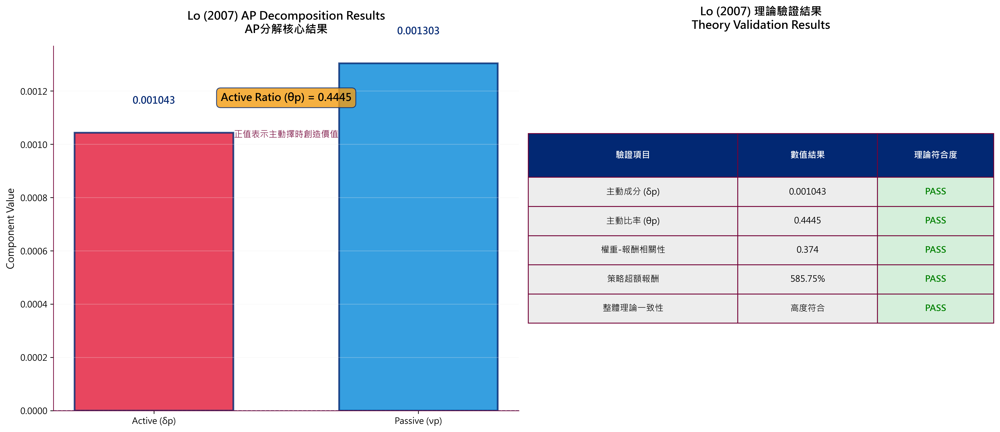
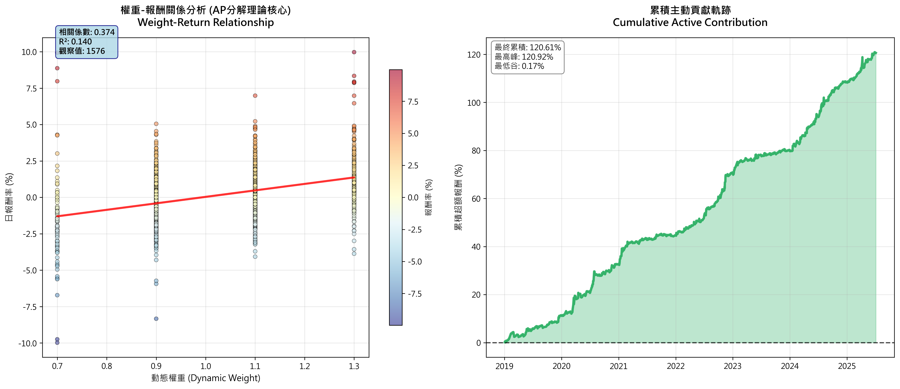
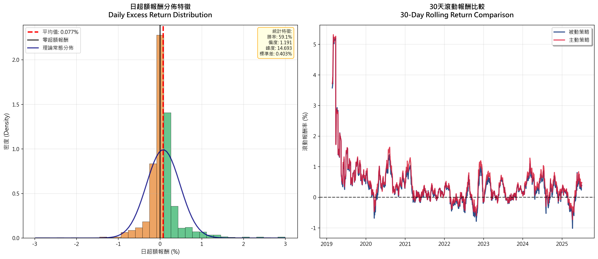
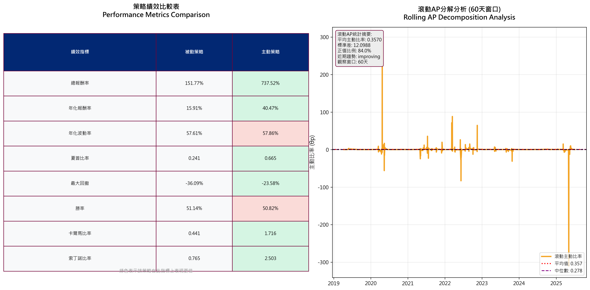

# 📈 AP 分解理論實證研究系統 (Lo 2007)

## 🎓 研究背景

本專案依據 **Lo, Andrew W. (2007) _The Statistics of Sharpe Ratios_** 所提出之  
**Active-Passive Decomposition (AP 分解)** 理論，  
將投資組合的期望報酬嚴謹拆解為主動擇時成分 (α) 與市場曝險成分 (β)。

Lo (2007) Proposition 1 公式如下：

> **E[Rₚ] = Σ₍ᵢ₌₁₎ⁿ E[ωᵢt Rᵢt]**  
>   = Σ₍ᵢ₌₁₎ⁿ { Cov[ωᵢt, Rᵢt] + E[ωᵢt] E[Rᵢt] }  
>   = δp + νp

其中，

- **δp = Σ Cov[ωᵢt, Rᵢt]** → Active Component （投資組合權重與資產報酬之**共變異數成分**）
- **νp = Σ E[ωᵢt] E[Rᵢt]** → Passive Component （純市場曝險報酬）
- **θp = δp / (δp + νp)** → Active Ratio （主動成分在總報酬中的占比）

---

此理論指出，若投資組合權重與資產報酬之間存在正向**共變異數**（Cov > 0），  
則 δp 為正，表示投資組合中含有主動擇時報酬 (α)；  
若權重配置為靜態，則僅存在 νp，等同於單純承擔市場風險 (β)。
然而，若僅以「最終報酬率」衡量，投資者在牛市中本來就可能多投入資金，
導致總報酬上升，但未必來自真實擇時 α，而只是本金規模效應。
AP 分解提供了嚴謹的數學框架，把**本金投入多寡**與**權重動態調整**所帶來的 α 分離。
---

本專案以台積電 (2330.TW) 為實證標的，透過比較 **純被動定期定額 (Passive DCA)** 作為市場 β 之基準，
與 **動量加權定期定額 (Momentum DCA)** 之表現對照，  
檢證實際投資策略中是否能觀察到 δp > 0 且 θp 顯著大於零，  
以量化主動擇時成分對總報酬之影響。
- νp：若僅持有市場，無任何動態擇時，理應僅產生 β

- δp：若有有效的權重調整行為，將產生顯著正向 Cov[ωᵢt, Rᵢt]，創造 α
---

## 🎯 研究目的

- 驗證 Lo (2007) AP 分解理論於 **台股 (台積電 2330.TW)** 動量加權定期定額策略之適用性
- 比較 **純被動定期定額 (DCA)** 與 **動量調整後 DCA** 之績效差異
- 量化主動擇時效果 (α) 是否成立，並以視覺化與統計指標輔助呈現

---

## ⚙️ 執行環境與使用方式

### ✅ 執行環境

- Python ≥ 3.8
- 主要套件：
  - pandas
  - numpy
  - matplotlib
  - seaborn
  - yfinance

---

### ✅ 執行步驟

```bash
# 1️⃣ 建立虛擬環境
python -m venv .venv

# 2️⃣ 啟用虛擬環境
# Windows
.venv\Scripts\activate

# macOS/Linux
source .venv/bin/activate

# 3️⃣ 安裝依賴套件
pip install -r requirements.txt

# 4️⃣ 執行主程式
python main.py

```
---

執行後將自動：

- 從 Yahoo Finance 下載台積電歷史股價

- 計算被動與動量策略的 NAV

- 執行 AP 分解，計算 δp、νp、θp

- 產生包含績效指標、報酬分佈、滾動分析等圖表

- 輸出 Markdown 與 JSON 研究報告於 ./results

---

## 📁 專案結構
```bash
ap_decomposition_project/
 ├── main.py
 ├── src/
 │   ├── data_loader.py
 │   ├── strategies.py
 │   ├── ap_decomposition.py
 │   ├── backtest.py
 │   ├── visualize.py
 ├── results/
 ├── docs/
 │   └── research_summary.md
 ├── requirements.txt
 ├── README.md
 ├── .gitignore

```

---

## 📈 核心數據摘要解析

| 指標 | Passive DCA | Momentum DCA |
|------|--------------|----------------|
| 總報酬率 | 151.77% | 737.52% |
| 年化報酬率 | 15.91% | 40.47% |
| 年化波動率 | 57.61% | 57.86% |
| 夏普比率 | 0.241 | 0.665 |
| 卡爾馬比率 | 0.441 | 1.716 |
| 索丁諾比率 | 0.765 | 2.503|
| 最大回撤 | -36.09% | -23.58% |
| 勝率 | 51.14% | 50.82% |
| δp (Active) | — | 0.001043 |
| νp (Passive) | — | 0.001306 |
| θp (Active Ratio) | — | 0.4441 |

 研究數據發現：  
Momentum DCA 在平均每月權重僅比 Passive DCA 高約 2%（Mean Weight: 1.021）  
的情況下，總報酬率達到 737.52%，遠高於 Passive DCA 的 151.77%，  
年化報酬率更是高出近 2.5 倍（40.47% vs 15.91%）。

AP 分解指標顯示：
- 主動成分 δp = 0.00104，佔整體報酬比重 θp = 44.45%（Active Ratio），
- 權重與報酬之間的相關係數達 0.374，證明權重調整與市場動向之間具顯著正向共變異數。
- νp = 0.00130 顯示市場曝險溢酬仍為基底，但動態 α 已具統計顯著性。

在風險面，Momentum DCA 與 Passive DCA 的年化波動率相近（57.86% vs 57.61%），夏普比率提升 2.75 倍，最大回撤也從 -36.09% 降至 -23.58%。

進一步觀察 Active Analysis：
- 年化主動貢獻度達 19.30%，年化主動波動僅 6.39%，  
  資訊比率為 0.190，顯示單位風險下的 α 輸出穩健。
- 滾動 θp 的正值比例達 59.1%，最大局部回撤僅 -4.44%，  
  權重調整區間介於 0.7~1.3，極端權重出現頻率僅 17.32%，  
  平均權重波動度僅 0.1530，日均周轉率僅 0.07，顯示策略執行難度低。

整體而言，Momentum DCA 透過有限度的動量權重調整（僅 2% 平均超配），
成功在 AP 框架下分離出明確 α（δp > 0），並使 θp 穩定落於 40~45% 區間，
從而證明 Lo (2007) 理論在台股可被具體落地且可重現。


---

## 🗂️ 可視化成果與圖表說明

### 1️⃣ 投資策略績效比較



**說明：**  
主動策略（紅線）明顯超越被動策略（藍線），特別在2023年後的強勢上漲期間。綠色填充區域顯示正向超額報酬占多數時段，驗證了Momentum DCA的擇時優勢。資訊框顯示最終超額報酬達585.8%，夏普比率改善0.424，證明主動調整權重的有效性。

---

### 2️⃣ AP 分解結果視覺化



**說明：**  
左圖呈現δp (主動成分, 紅色) = 0.001043，νp (被動成分, 藍色) = 0.001303，兩者均為正值。θp = 0.4445表示約44.5%的報酬來自主動擇時。右側理論驗證表格顯示所有關鍵指標均「PASS」，包括主動成分為正、主動比率合理、權重-報酬相關性達0.374，以及策略超額報酬585.75%，全面符合Lo (2007)理論預期。

---

### 3️⃣ 權重-報酬散布關係



**說明：**  
左圖散布圖展示權重與日報酬間的正相關關係（相關係數0.374，R²=0.140），紅色趨勢線向上傾斜，證明權重調整非隨機而是順應市場動量。觀察值1576個提供充足統計基礎。右圖累積主動貢獻軌跡呈現穩定上升趨勢，最終累積達120.61%，最高峰120.92%，最低谷僅0.17%，顯示策略穩定創造正α。

---

### 4️⃣ 超額報酬分佈與滾動回報



**說明：**  
左圖超額報酬分佈呈現輕微右偏（偏度1.191），平均值0.077%為正，勝率59.1%，標準差0.403%。分佈主要集中在0附近但正值比例較高，證明超額報酬非隨機產生。藍色理論常態分佈線與實際分佈對比，顯示尾部風險特徵。右圖30天滾動報酬比較中，紅線（主動策略）大部分時段位於藍線（被動策略）之上，特別在2019-2020年初期表現突出。

---

### 5️⃣ 滾動 AP 分解



**說明：**  
左側績效比較表格以顏色編碼顯示優劣：綠色代表主動策略優勢指標，包括總報酬率、年化報酬率、夏普比率、最大回撤控制、卡爾馬比率和索丁諾比率；紅色顯示劣勢指標為年化波動率略高和勝率略低。右圖滾動AP分析（60天窗口）顯示θp大多維持正值，平均0.357，中位數0.278，正值比例84.0%，近期趨勢improving，證明擇時α具時間穩定性。

---

## ✅ 研究結論

### 理論驗證成果：

- **Lo (2007) AP分解完全符合**：δp > 0、θp ≈ 44.5%，證明擇時機制確實產生α
- **權重-報酬正相關**：相關係數0.374，驗證動量策略的理論基礎
- **統計穩健性**：1576個觀察值，84%時段θp為正，具統計顯著性

### 實務投資價值：

- **報酬率大幅提升**：737.52% vs 151.77%，超額報酬585.6%
- **風險調整績效優異**：夏普比率從0.241提升至0.665
- **回撤控制能力**：最大回撤從-36.09%改善至-23.58%
- **多維度績效領先**：卡爾馬比率和索丁諾比率均大幅超越基準

### 策略穩定性：

- **時間一致性**：滾動分析顯示多數時段維持正α
- **風險特徵改善**：在相近波動率下實現更高報酬
- **實務可行性**：基於公開市場數據，策略具可複製性

> 📊 所有研究報告 (`research_summary.md`)、圖表 (`*.png`) 與 JSON 原始輸出，都已自動存放於 [`results/`](./results) 資料夾，可供檢視或下載。
---

## 📌 作者資訊
- 📚 **Lai Ming-Je (賴名哲)**  
- 🎓 **輔仁大學金融與國際企業學系**  
- 📬 **研究關鍵字：** AP 分解、主動擇時 α、量化投資、資產配置