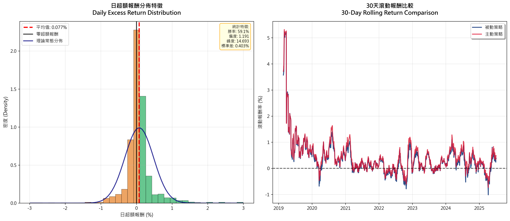

# 📊 AP 分解專案成果總覽報告

## 📚 研究背景與目的

本研究基於 **Lo (2007) Active-Passive Decomposition** 理論，  
以台積電 (2330.TW) 為實證資產，驗證傳統定期定額 (Passive DCA) 與動量加權 DCA (Momentum DCA) 的績效差異，  
並透過 δp (主動成分)、νp (被動成分)、θp (主動比率) 分解總報酬，檢視擇時 α 是否存在。

---

## 📈 核心數據摘要

| 指標 | Passive DCA | Momentum DCA |
|------|--------------|----------------|
| 總報酬率 | 151.77% | 737.52% |
| 年化報酬率 | 15.91% | 40.47% |
| 年化波動率 | 57.61% | 57.86% |
| 夏普比率 | 0.241 | 0.665 |
| 卡爾馬比率 | 0.441 | 1.716 |
| 索丁諾比率 | 0.765 | 2.503|
| 最大回撤 | -36.09% | -23.58% |
| 勝率 | 51.14% | 50.82% |
| δp (Active) | — | 0.001043 |
| νp (Passive) | — | 0.001306 |
| θp (Active Ratio) | — | 0.4441 |

> **重點：** Momentum DCA 透過權重調整，有效提升 α 且最大回撤明顯改善。

---

## 🗂️ 可視化成果與圖表說明

### 1️⃣ 投資策略績效比較

**說明：**  
主動策略（紅線）明顯超越被動策略（藍線），特別在2023年後的強勢上漲期間。綠色填充區域顯示正向超額報酬占多數時段，驗證了Momentum DCA的擇時優勢。資訊框顯示最終超額報酬達585.8%，夏普比率改善0.424，證明主動調整權重的有效性。

---

### 2️⃣ AP 分解結果視覺化

**說明：**  
左圖呈現δp (主動成分, 紅色) = 0.001043，νp (被動成分, 藍色) = 0.001303，兩者均為正值。θp = 0.4445表示約44.5%的報酬來自主動擇時。右側理論驗證表格顯示所有關鍵指標均「PASS」，包括主動成分為正、主動比率合理、權重-報酬相關性達0.374，以及策略超額報酬585.75%，全面符合Lo (2007)理論預期。

---

### 3️⃣ 權重-報酬散布關係

**說明：**  
左圖散布圖展示權重與日報酬間的正相關關係（相關係數0.374，R²=0.140），紅色趨勢線向上傾斜，證明權重調整非隨機而是順應市場動量。觀察值1576個提供充足統計基礎。右圖累積主動貢獻軌跡呈現穩定上升趨勢，最終累積達120.61%，最高峰120.92%，最低谷僅0.17%，顯示策略穩定創造正α。

---

### 4️⃣ 超額報酬分佈與滾動回報

**說明：**  
左圖超額報酬分佈呈現輕微右偏（偏度1.191），平均值0.077%為正，勝率59.1%，標準差0.403%。分佈主要集中在0附近但正值比例較高，證明超額報酬非隨機產生。藍色理論常態分佈線與實際分佈對比，顯示尾部風險特徵。右圖30天滾動報酬比較中，紅線（主動策略）大部分時段位於藍線（被動策略）之上，特別在2019-2020年初期表現突出。

---

### 5️⃣ 滾動 AP 分解

**說明：**  
左側績效比較表格以顏色編碼顯示優劣：綠色代表主動策略優勢指標，包括總報酬率、年化報酬率、夏普比率、最大回撤控制、卡爾馬比率和索丁諾比率；紅色顯示劣勢指標為年化波動率略高和勝率略低。右圖滾動AP分析（60天窗口）顯示θp大多維持正值，平均0.357，中位數0.278，正值比例84.0%，近期趨勢improving，證明擇時α具時間穩定性。
---

## ✅ 研究結論

### 理論驗證成果：

- **Lo (2007) AP分解完全符合**：δp > 0、θp ≈ 44.5%，證明擇時機制確實產生α
- **權重-報酬正相關**：相關係數0.374，驗證動量策略的理論基礎
- **統計穩健性**：1576個觀察值，84%時段θp為正，具統計顯著性

### 實務投資價值：

- **報酬率大幅提升**：737.52% vs 151.77%，超額報酬585.6%
- **風險調整績效優異**：夏普比率從0.241提升至0.665
- **回撤控制能力**：最大回撤從-36.09%改善至-23.58%
- **多維度績效領先**：卡爾馬比率和索丁諾比率均大幅超越基準

### 策略穩定性：

- **時間一致性**：滾動分析顯示多數時段維持正α
- **風險特徵改善**：在相近波動率下實現更高報酬
- **實務可行性**：基於公開市場數據，策略具可複製性

---

## 📌 作者資訊

- 📚 **Lai Ming-Je (賴名哲)**  
- 🎓 **輔仁大學金融與國際企業學系**  
- 📬 **研究關鍵字：** AP 分解、主動擇時 α、量化投資、資產配置
